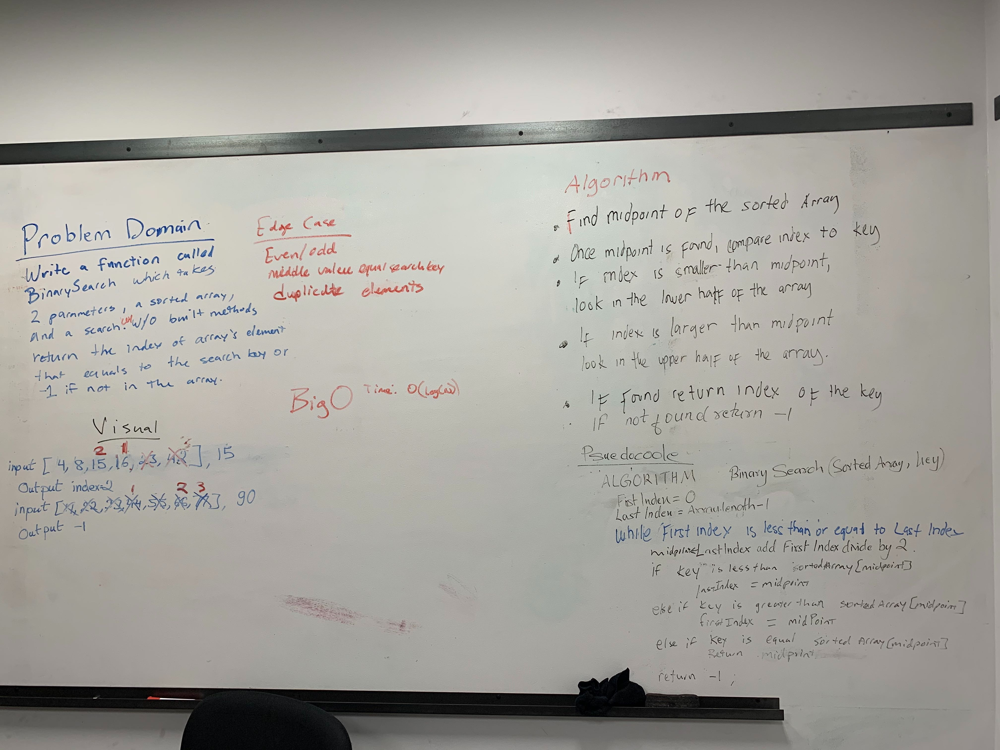

# Challenge Summary
<!-- Short summary or background information -->
[Code](/code401challenges/src/main/java/code401challenges/BinarySearch.java)

 A binary search of a element within an array.

## Challenge Description
<!-- Description of the challenge -->
Write a function called BinarySearch which takes in 2 parameters: a sorted array and the search key. Without utilizing any of the built-in methods available to your language, return the index of the array’s element that is equal to the search key, or -1 if the element does not exist.
## Approach & Efficiency
<!-- What approach did you take? Why? What is the Big O space/time for this approach? -->
We set the right and left integers to the index of the first and last element within the array respectively. Then iterate in a loop to see if the search key is less than, greater than, or equal to the element at the mid point. If it is less than, then the right integer is assigned to the mid point. If it is greater than, then the left integer is assigned to the midpoint. if it is equals, then the midpoint is returned. If not found, then returns -1.

## Solution
<!-- Embedded whiteboard image -->
