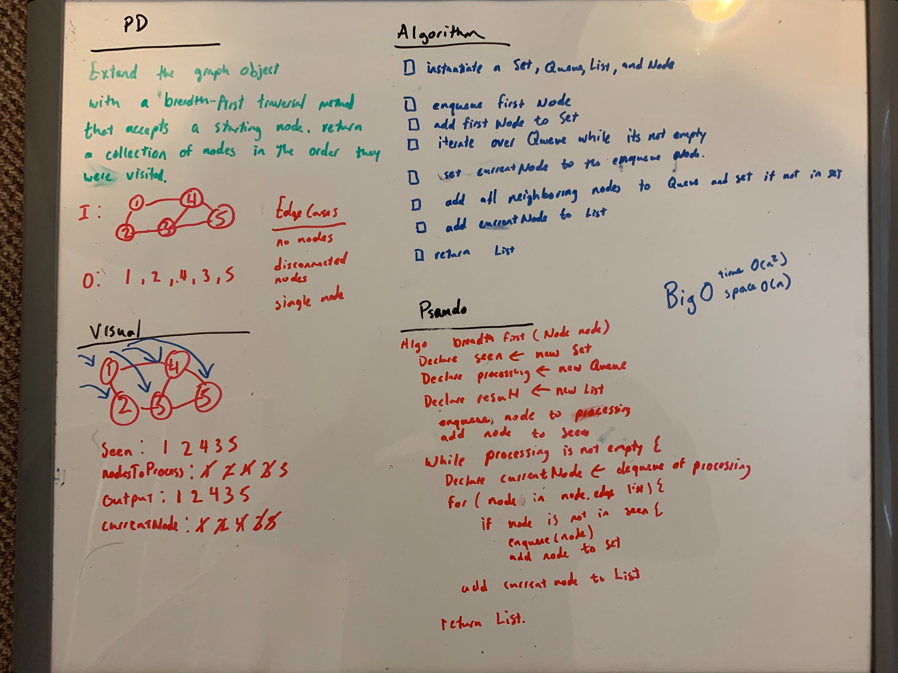

# Challenge Summary
<!-- Short summary or background information -->
[Code](/code401challenges/src/main/java/code401challenges/BreadthFirst/BreadthFirst.java)

BreadthFirst traversal on a graph that can be cyclic.
## Challenge Description
<!-- Description of the challenge -->

Extend your graph object with a breadth-first traversal method that accepts a starting node. Without utilizing any of the built-in methods available to your language, return a collection of nodes in the order they were visited. Display the collection.
## Approach & Efficiency
<!-- What approach did you take? Why? What is the Big O space/time for this approach? -->

It takes in a Node and at first stores the node in a seen Set and a need to process queue. While the queue is not empty, the dequeued node gets assigned to a currentNode variable. Then checks to see if any nodes within the edges has been seen yet, if not then it is added to the queue. lastly adds the currentnode to the list. BigO for time is O(n^2) and for space is O(n)
## Solution
<!-- Embedded whiteboard image -->
