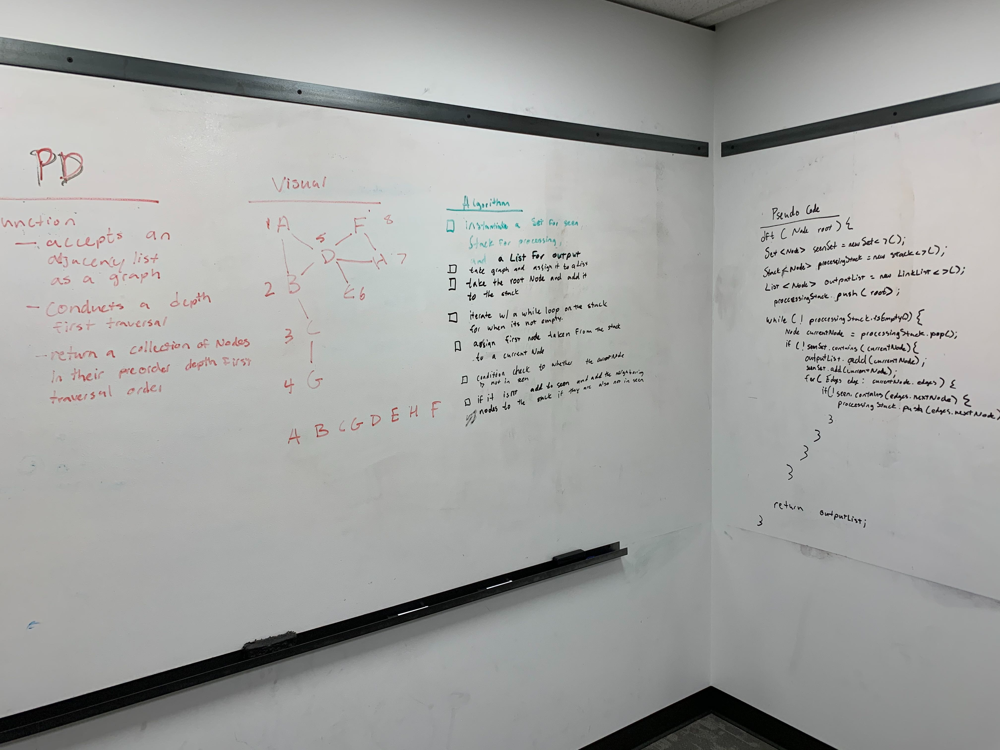

# Challenge Summary
<!-- Short summary or background information -->
[Code](/code401challenges/src/main/java/code401challenges/DepthFirst/DepthFirst.java)

Traverse depth first on a graph given a root node.
## Challenge Description
<!-- Description of the challenge -->

Create a function that accepts an adjacency list as a graph, and conducts a depth first traversal. Without utilizing any of the built-in methods available to your language, return a collection of nodes in their pre-order depth-first traversal order.

## Approach & Efficiency
<!-- What approach did you take? Why? What is the Big O space/time for this approach? -->

It takes in a Node and at first stores the node in a seen Set and a need to process stack. While the stack is not empty, the popped node gets assigned to a currentNode variable. Then checks to see if any nodes within the edges has been seen yet, if not then it is added to the stack. lastly adds the currentnode to the list. BigO for time is O(n^2) and for space is O(n)

## Solution
<!-- Embedded whiteboard image -->
