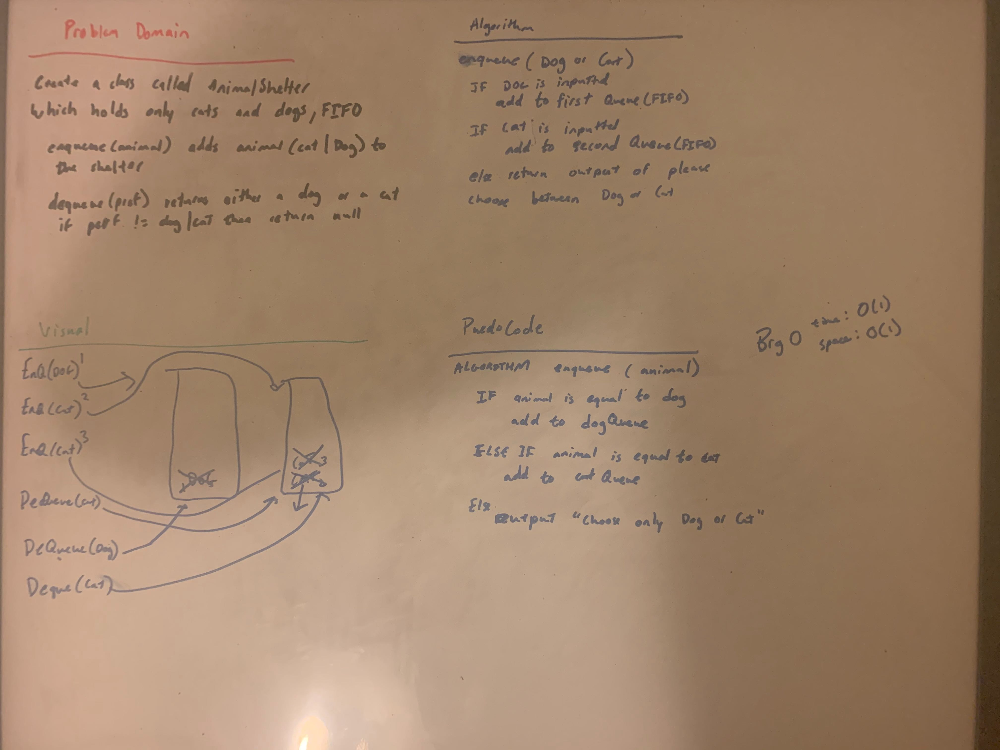

# Stacks and Queues
<!-- Short summary or background information -->
[Code](/code401challenges/src/main/java/code401challenges/utilities/AnimalShelter.java)

Create a AnimalShelter class that only holds dogs or cats
## Challenge
<!-- Description of the challenge -->

Create a class called AnimalShelter which holds only dogs and cats. The shelter operates using a first-in, first-out approach.
Implement the following methods:
enqueue(animal): adds animal to the shelter. animal can be either a dog or a cat object.
dequeue(pref): returns either a dog or a cat. If pref is not "dog" or "cat" then return null.
## Approach & Efficiency
<!-- What approach did you take? Why? What is the Big O space/time for this approach? -->
 I think the best way I thought of was to include the Queues that we created. And kind of make it similar to the PsuedoQueue in where we have two stacks for either dog or cat.
 The bigO for time is O(1) and for space is O(1) for both methods
 
## Solution
<!-- Embedded whiteboard image -->
