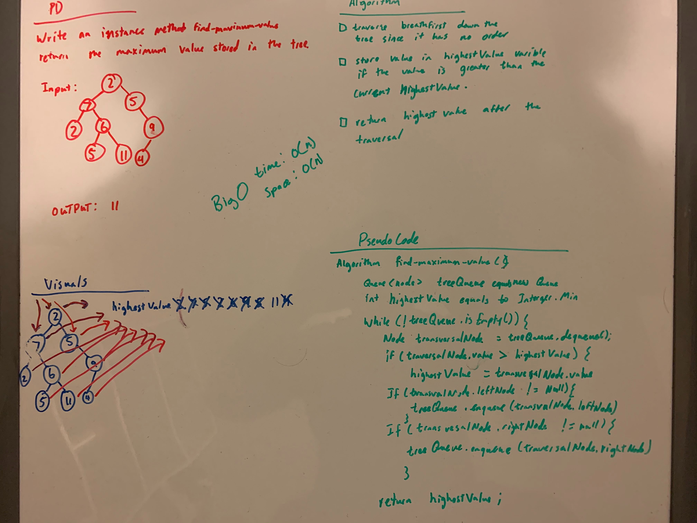

# Challenge Summary
[Code](/code401challenges/src/main/java/code401challenges/tree/Tree.java)
<!-- Short summary or background information -->
Find the Maximum value in a binary tree.
## Challenge Description
<!-- Description of the challenge -->

Write an instance method called find-maximum-value. Without utilizing any of the built-in methods available to your language, return the maximum value stored in the tree. You can assume that the values stored in the Binary Tree will be numeric.
## Approach & Efficiency
<!-- What approach did you take? Why? What is the Big O space/time for this approach? -->
I utilized the Queue class that I created and initially added the first element from the Tree into the Queue. Then I iterated over the Queue.
During the iteration the Node value is checked for if it greater than the current high value. If it is then the value becomes the current high value. Then the right Node and the left Node is added to the Queue if null.
The Big O is O(n) for time and O(n) for space
## Solution
<!-- Embedded whiteboard image -->
