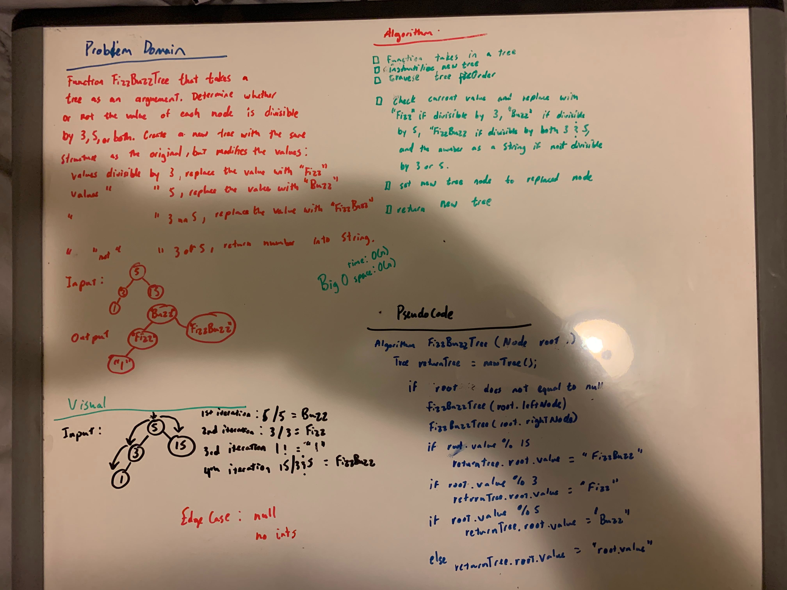

# Challenge Summary
<!-- Short summary or background information -->
[Code](/code401challenges/src/main/java/code401challenges/utilities/FizzBuzzTree.java)

Write a method that takes in a tree and converts it to Fizz, Buzz, or FizzBuzz in string.
## Challenge Description
<!-- Description of the challenge -->
Write a function called FizzBuzzTree which takes a tree as an argument.
Without utilizing any of the built-in methods available to your language, determine whether or not the value of each node is divisible by 3, 5 or both. Create a new tree with the same structure as the original, but the values modified as follows:
If the value is divisible by 3, replace the value with “Fizz”
If the value is divisible by 5, replace the value with “Buzz”
If the value is divisible by 3 and 5, replace the value with “FizzBuzz”
If the value is not divisible by 3 or 5, simply turn the number into a String.
Return the new tree.
## Approach & Efficiency
<!-- What approach did you take? Why? What is the Big O space/time for this approach? -->

It will be like traversing through the tree and take the value and convert it to "Fizz" if the value is divisible by 3.

## Solution
<!-- Embedded whiteboard image -->
