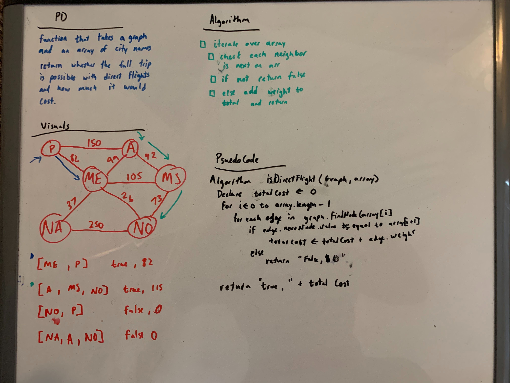

# Challenge Summary
<!-- Short summary or background information -->

[Code](/code401challenges/src/main/java/code401challenges/GetEdge/GetEdge.java)

Find the direct flight to one place to another and the total cost of the travel.
## Challenge Description
<!-- Description of the challenge -->

Write a function based on the specifications above, which takes in a graph, and an array of city names. Without utilizing any of the built-in methods available to your language, return whether the full trip is possible with direct flights, and how much it would cost.
## Approach & Efficiency
<!-- What approach did you take? Why? What is the Big O space/time for this approach? -->

Check each array and look for the node within the graph, then iterate over the list of edges to find if the next element in the array is in there. The Big(O) for time is O(n^3) and space is O(1).
## Solution
<!-- Embedded whiteboard image -->
