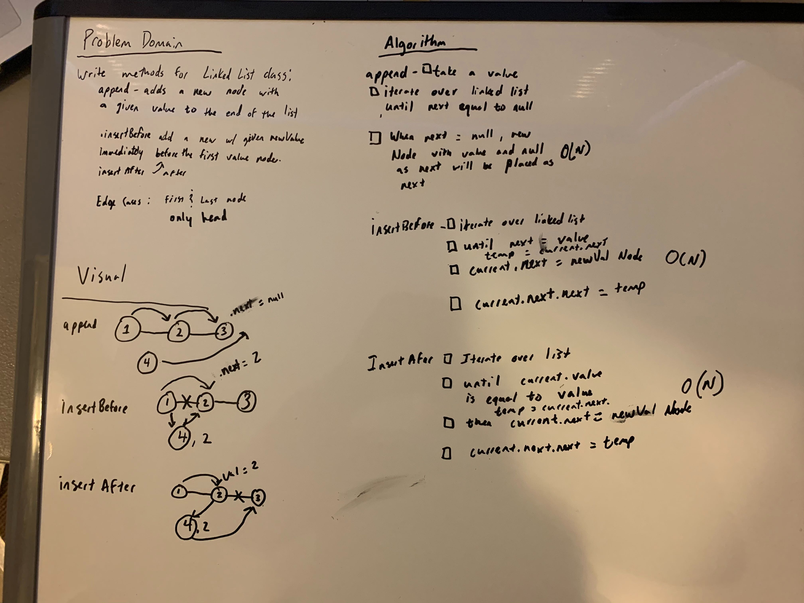

# Challenge Summary
<!-- Short summary or background information -->
[Code](/code401challenges/src/main/java/code401challenges/linkedList/LinkedList.java)

Extending LinkedList Class to append, insertBefore, insertAfter, and delete

## Challenge Description
<!-- Description of the challenge -->
Write the following methods for the Linked List class:

.append(value) which adds a new node with the given value to the end of the list
.insertBefore(value, newVal) which add a new node with the given newValue immediately before the first value node
.insertAfter(value, newVal) which add a new node with the given newValue immediately after the first value node
write an additional method to delete a node with the given value from the linked list.
## Approach & Efficiency
<!-- What approach did you take? Why? What is the Big O space/time for this approach? -->
For these methods I would have to iterate over the linked like until I find a value needed for the methods. For example, for append, since the new value is being placed at the end, I look for the .next is equal to null, then place the new value as the .next of the current Node. For insertBefore, I look for the .next of the current to be the search value, then switch the current.next to be the new value and the new value.next to be the old current.next.
## Solution
<!-- Embedded whiteboard image -->
