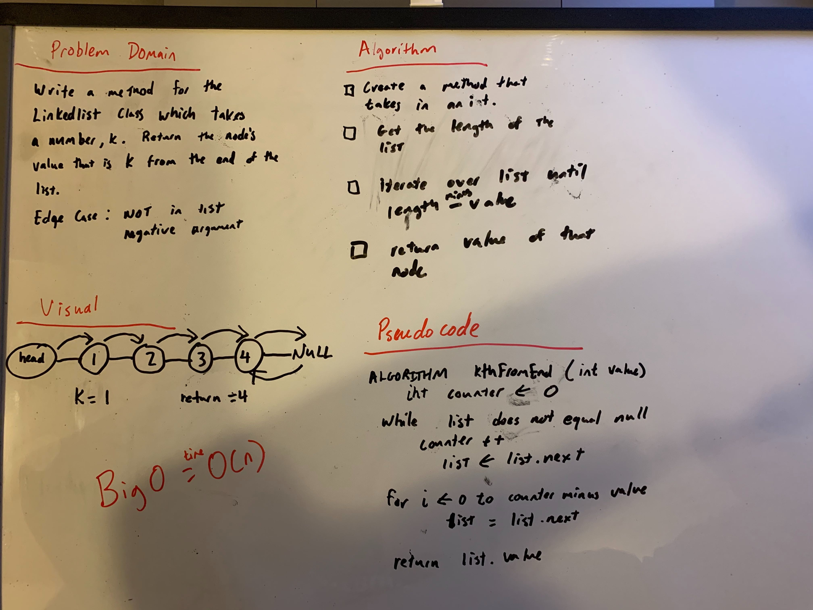

# Challenge Summary
<!-- Short summary or background information -->
[Code](/code401challenges/src/main/java/code401challenges/linkedList/LinkedList.java)

Write a method that finds the nth value from the end of the LinkedList
## Challenge Description
<!-- Description of the challenge -->
Write a method for the Linked List class which takes a number, k, as a parameter. Return the node’s value that is k from the end of the linked list. You have access to the Node class and all the properties on the Linked List class as well as the methods created in previous challenges. 
Test:
Where k is greater than the length of the linked list
Where k and the length of the list are the same
Where k is not a positive integer
Where the linked list is of a size 1
“Happy Path” where k is not at the end, but somewhere in the middle of the linked list
## Approach & Efficiency
<!-- What approach did you take? Why? What is the Big O space/time for this approach? -->
Iterate over the LinkedList for size of list minus k times and return the value.

## Solution
<!-- Embedded whiteboard image -->
