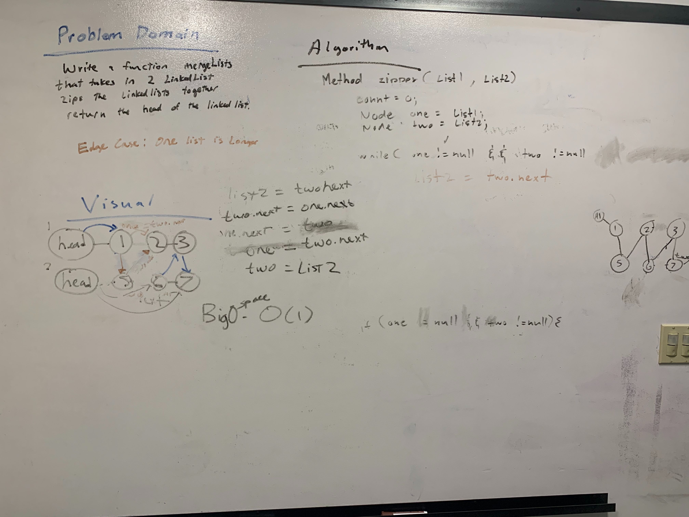

# Challenge Summary
<!-- Short summary or background information -->
A static utility method that zips two linked lists into one.

## Challenge Description
<!-- Description of the challenge -->
Write a function called mergeLists which takes two linked lists as arguments. Zip the two linked lists together into one so that the nodes alternate between the two lists and return a reference to the head of the zipped list. Try and keep additional space down to O(1). You have access to the Node class and all the properties on the Linked List class as well as the methods created in previous challenges.

## Approach & Efficiency
<!-- What approach did you take? Why? What is the Big O space/time for this approach? -->
I did it two ways, the first way uses placeholders and gets the next property pointed to the correct sequence in the zip. The other way I did it recursively because when we were doing the visuals to the white board, It looked very similar to the Fib Seq method that we created.

## Solution
<!-- Embedded whiteboard image -->
