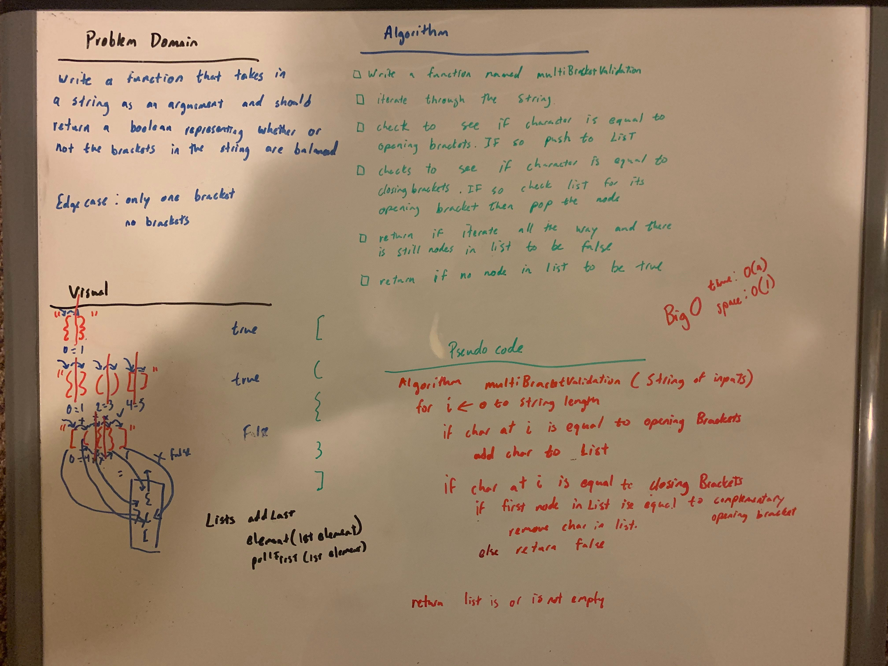

# Challenge Summary
<!-- Short summary or background information -->
[Code](/code401challenges/src/main/java/code401challenges/utilities/MultiBracketValidation.java)

A validation method for pairs of brackets
## Challenge Description
<!-- Description of the challenge -->
Create a method public static boolean multiBracketValidation(String input)
Your function should take a string as its only argument, and should return a boolean representing whether or not the brackets in the string are balanced. There are 3 types of brackets:

Round Brackets : ()
Square Brackets : []
Curly Brackets : {}
## Approach & Efficiency
<!-- What approach did you take? Why? What is the Big O space/time for this approach? -->
I iterated through the string and at each character, check if its an opening bracket or closing bracket. If it is an opening bracket then push to a list.
If it is a closing bracket, then to check to see if the list's last placed element is its counterpart. If it is then remove it. If not then return false, assuming that they are pairs with order.

## Solution
<!-- Embedded whiteboard image -->
