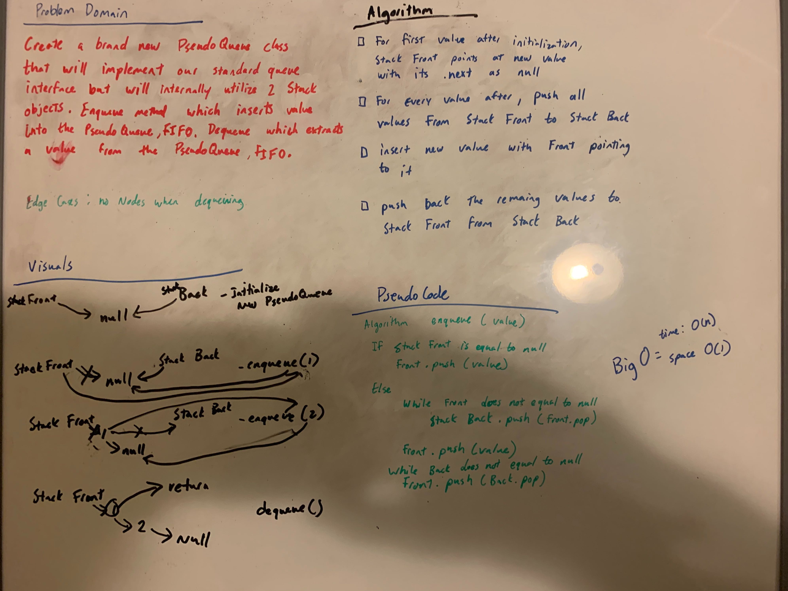

# Challenge Summary
[Code](/code401challenges/src/main/java/code401challenges/stacksandqueues/PseudoQueue.java)
<!-- Short summary or background information -->
A PseudoQueue class that uses two Stack objects.
## Challenge Description
<!-- Description of the challenge -->

Create a brand new PseudoQueue class. Do not use an existing Queue. Instead, this PseudoQueue class will implement our standard queue interface (the two methods listed below), but will internally only utilize 2 Stack objects. Ensure that you create your class with the following methods:

enqueue(value) which inserts value into the PseudoQueue, using a first-in, first-out approach.
dequeue() which extracts a value from the PseudoQueue, using a first-in, first-out approach.
The Stack instances have only push, pop, and peek methods. You should use your own Stack implementation. Instantiate these Stack objects in your PseudoQueue constructor.
## Approach & Efficiency
<!-- What approach did you take? Why? What is the Big O space/time for this approach? -->
I utilized the methods with in the Stack class. I had to think about how I would structure the stacks in order to use them as one queue. The best way I thought of would be to push all from one stack into the other stack and the add the new value to the first stack. Lastly, I would push all from stack two back into stack one. This turned out to be a O(n) for time and O(1) for space.
## Solution
<!-- Embedded whiteboard image -->
