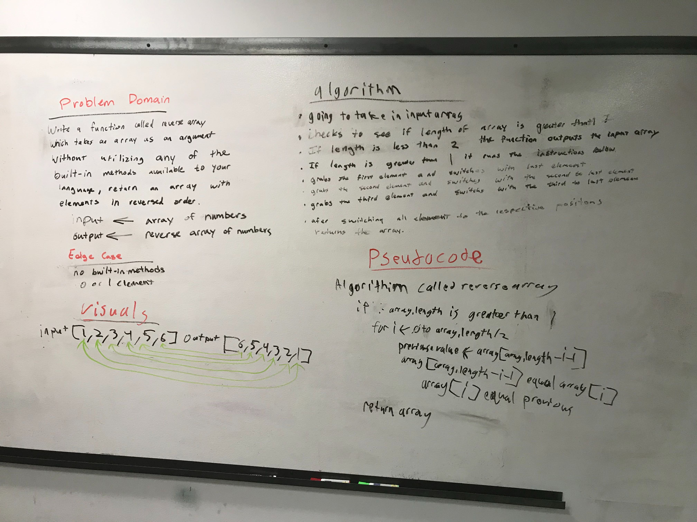

# Reverse an Array
<!-- Short summary or background information -->
[Code](/code401challenges/src/main/java/code401challenges/ArrayReverse.java)
A function called reverse array which takes an array as an argument and returns an array with elements in reverse order.
## Challenge
<!-- Description of the challenge -->
Input an array and with the function reverse the array.

## Approach & Efficiency
<!-- What approach did you take? Why? What is the Big O space/time for this approach? -->
We used an if loop to check to see if the array was greater than 1 because if it was smaller than it may break the code. We used a for loop to iterate over half of the array and then switch the elements to the corresponding one on the other side. I.E 0 = last, 1 = 2nd to last, etc...

## Solution
<!-- Embedded whiteboard image -->
