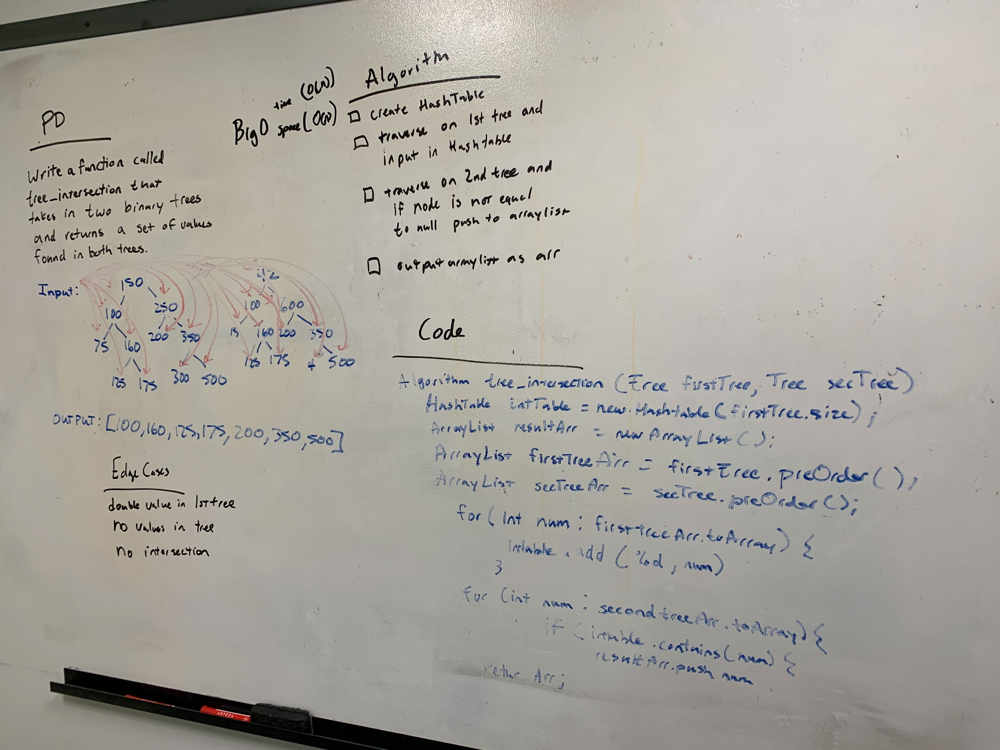

# Challenge Summary
<!-- Short summary or background information -->
[Code](../src/main/java/code401challenges/TreeIntersection/TreeIntersection.java)

Return an Array fo values found on both Trees
## Challenge Description
<!-- Description of the challenge -->

Write a function called tree_intersection that takes two binary tree parameters.
Without utilizing any of the built-in library methods available to your language, return a set of values found in both trees.

## Approach & Efficiency
<!-- What approach did you take? Why? What is the Big O space/time for this approach? -->

Traveserse down both trees which creates a Array for both trees. For the first Array add to HashTable. For the second Array check to see if each value is contained within the HashTable. BigO for time is O(n) and for Space is O(n).
## Solution
<!-- Embedded whiteboard image -->
