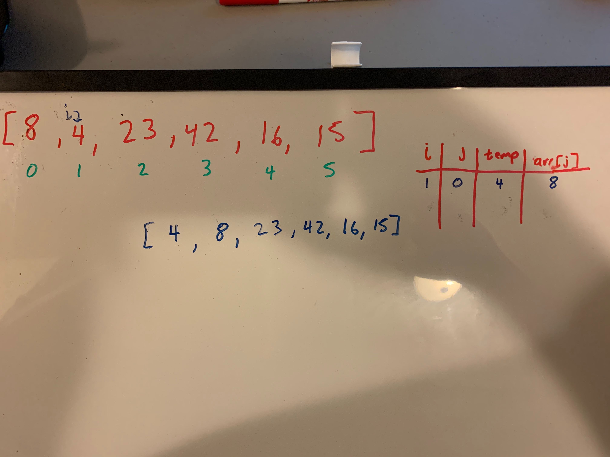
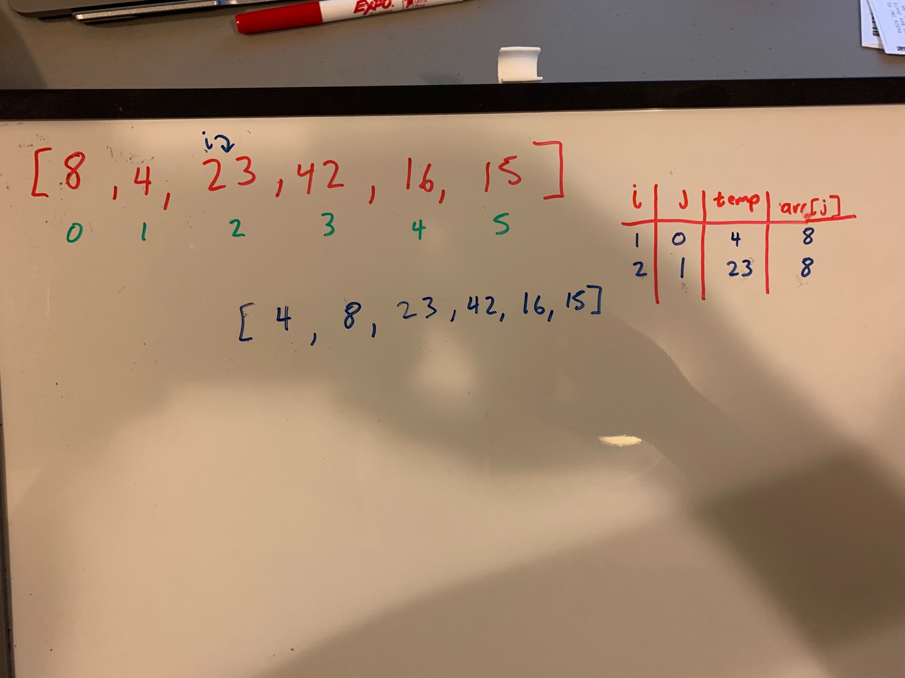
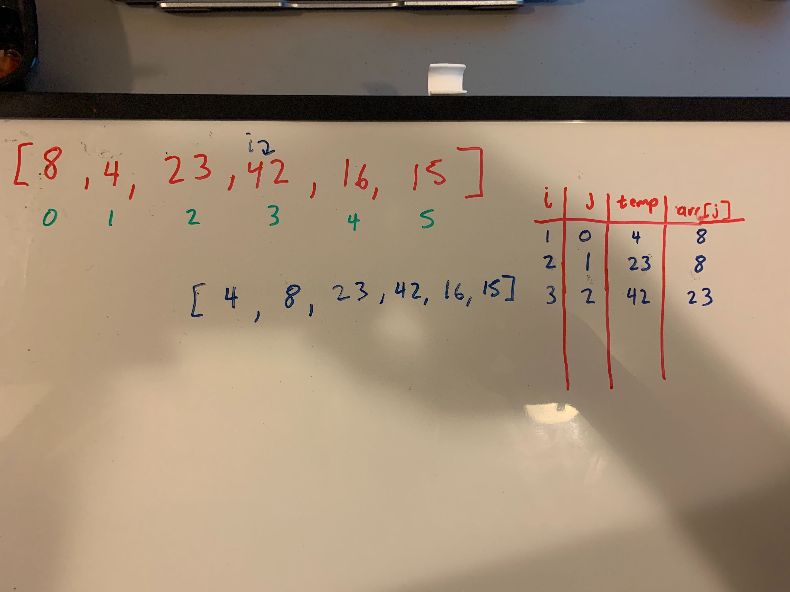
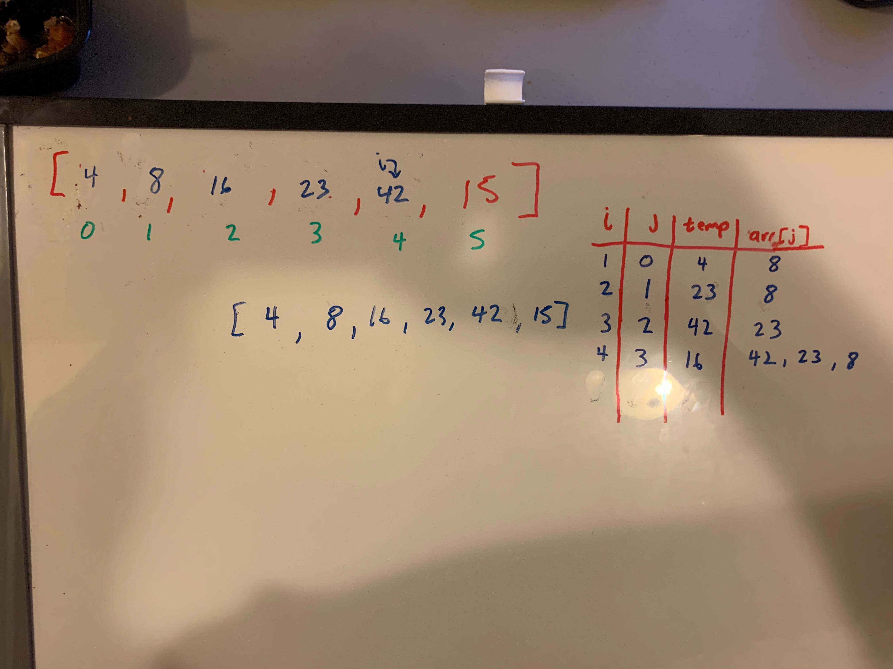
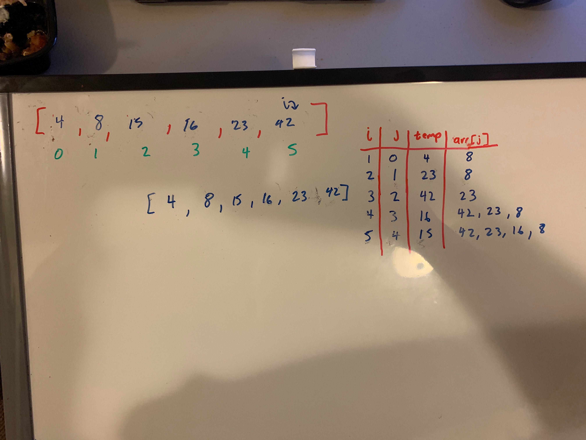

# Insertion Sort

##Problem Domain
Insertion Sorting is a sorting algorithm that is like playing cards into one's hands and sort as soon as you get one card from least to greatest.
The sorting takes in a int array where it loops through the entire array. While the pointer is at each index, it will compare it to the elements on the left which is sorted and place the element in the correct spot.

 ##Pseudocode
 ```
InsertionSort(int[] arr)
  
    FOR i = 1 to arr.length
    
      int j <-- i - 1
      int temp <-- arr[i]
      
      WHILE j >= 0 AND temp < arr[j]
        arr[j + 1] <-- arr[j]
        j <-- j - 1
        
      arr[j + 1] <-- temp
```

##Examples
Input: `[8,4,23,42,16,15]`

###First Pass: 


On the first pass, the integer at index 1 in the array is stored in a temp variable. Since it is less than the integer at index 0, then the array at index 0 is placed at the index at index 1. Lastly the temp value will be placed at index 0.

###Second Pass: 


On the second pass, the integer at index 2 which is 23 is stored in a temp variable. Since it is greater than the integer at index 1, then it will be placed back on index of 2.

###Third Pass: 


On the third pass, the integer at index 3 which is 42 is stored in a temp variable. Since it is greater than the integer at index 2, then it will be placed back on index of 3.

###Fourth Pass: 


On the fourth pass, the integer at index 4 which is 16 is stored in a temp variable. Since it is less than the integer at index 3, then 42 will be placed on index of 4. And since the integer at index 2 is greater than the temp, then 23 is placed at index of 3. 16 will then be placed at index of 2.


###Final Pass: 


On the fifth pass, the integer at index 5 which is 15 is stored in a temp variable. Since it is less than the integer at index 4, then 42 will be placed on index of 5. And since the integer at index 3 is greater than the temp, then 23 is placed at index of 4. And since the integer at index 2 is greater than the temp, then 16 is placed at index of 3. 15 will then be placed at index of 2.

##Efficiency

###Time

- O(n^2)
    - It will compare each element within the array and this happens n times.
    
- O(1)
    - No additional space is created as it will be sorted in place.
    


