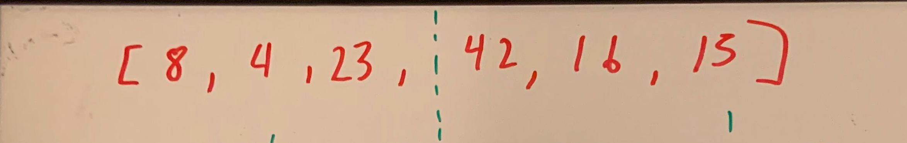
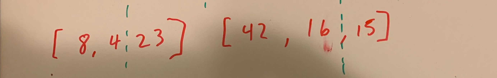
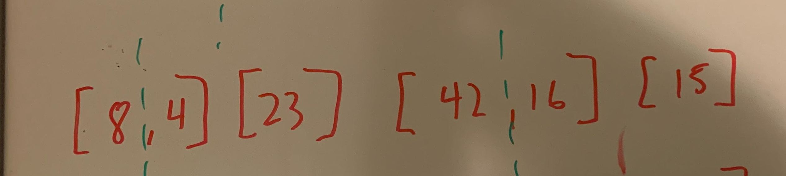
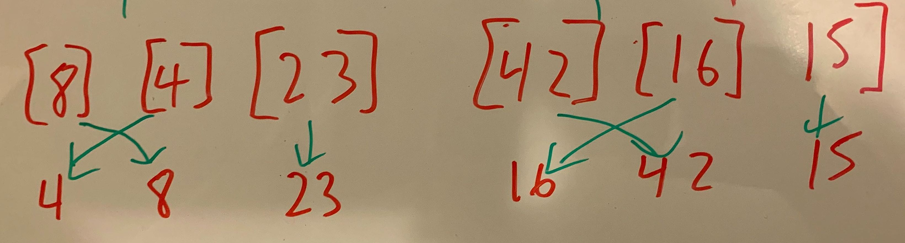
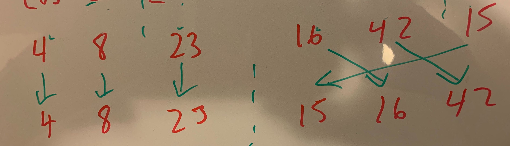
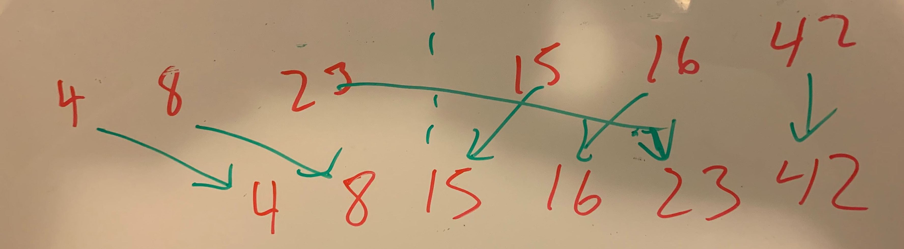

# Merge Sort

##What it is

Merge Sort is a sorting algorithm that takes in an integer array. With this array, the method divides the array in half until it becomes the smallest size array it can be and then start merging each one from least to greatest using a merge function.


 ##Pseudocode
 ```
ALGORITHM Mergesort(arr)
    DECLARE n <-- arr.length
           
    if n > 1
      DECLARE mid <-- n/2
      DECLARE left <-- arr[0...mid]
      DECLARE right <-- arr[mid...n]
      // sort the left side
      Mergesort(left)
      // sort the right side
      Mergesort(right)
      // merge the sorted left and right sides together
      Merge(left, right, arr)

ALGORITHM Merge(left, right, arr)
    DECLARE i <-- 0
    DECLARE j <-- 0
    DECLARE k <-- 0

    while i < left.length && j < right.length
        if left[i] <= right[j]
            arr[k] <-- left[i]
            i <-- i + 1
        else
            arr[k] <-- right[j]
            j <-- j + 1
            
        k <-- k + 1

    if i = left.length
       set remaining entries in arr to remaining values in right
    else
       set remaining entries in arr to remaining values in left

```

##Examples
Input: `[8,4,23,42,16,15]`

###First Split: 


On the first call stack, the array will be split in half with two sides: left and right. It will wait for the return of the next call stack.

###Second Split: 


On the second call stack, mergesort is called for both left and right. This splits both to left and right each and awaits the return of the next call stack.

###Third Split: 


On the third call stack, mergesort is called for both left and right of both of the sides of the previous call stack. It splits all the sides to another left and right each. Then awaits the return of the next call stack if it can be split again. If not then all the call stacks will return.

###First Return: 


On the first return, the third call stack with all the splits will sort from least to greatest, then return to the previous call stack.

###Second Return: 


On the second return, the second call stack with the previous return will compare and sort from least to greatest. Then return to the previous call stack.

###Final Return: 


On the last return, the first call stack with the previous return will sort and merge. Then returns the final array that is sorted.

##Efficiency

###Time

- O(n log n)
    - It will compare each element within the array but cut it in half of the size.
    
- O(1)
    - No additional space is created as it will be sorted in place.
    


