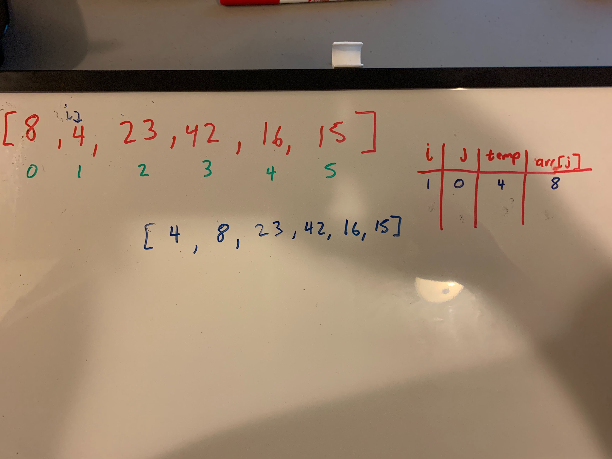
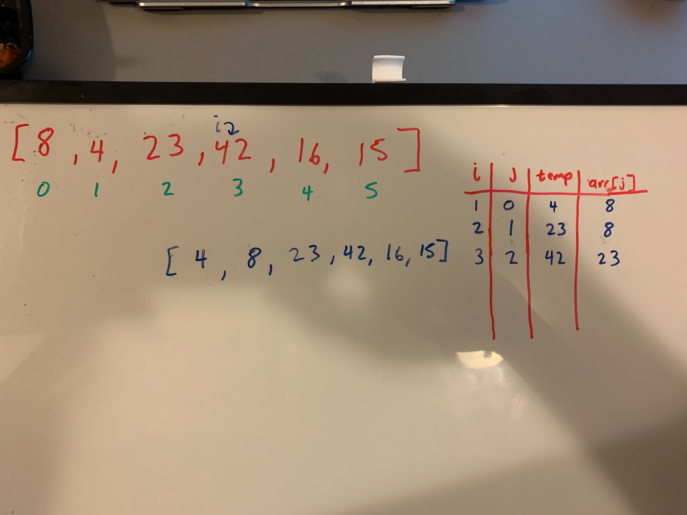

# Quick Sort

##Problem Domain

Quick Sort is a sorting algorithm that takes in an int array. A pivot element will be chosen at random. The other elements will be placed on the right of the pivot element if it is less than the pivot. If the elements are greater than the pivot element, then it will placed on the right. This will happen over and over again until the it is broken all the way down with no split can be achieved.

 ##Pseudocode
 ```
ALGORITHM QuickSort(arr, left, right)
    if left < right
        // Partition the array by setting the position of the pivot value 
        DEFINE position <-- Partition(arr, left, right) 
        // Sort the left
        QuickSort(arr, left, position - 1)
        // Sort the right
        QuickSort(arr, position + 1, right)

ALGORITHM Partition(arr, left, right)
    // set a pivot value as a point of reference
    DEFINE pivot <-- arr[right]
    // create a variable to track the largest index of numbers lower than the defined pivot
    DEFINE low <-- left - 1
    for i <- left to right do
        if arr[i] <= pivot
            low++
            Swap(arr, i, low)

     // place the value of the pivot location in the middle.
     // all numbers smaller than the pivot are on the left, larger on the right. 
     Swap(arr, right, low + 1)
    // return the pivot index point
     return low + 1

ALGORITHM Swap(arr, i, low)
    DEFINE temp;
    temp <-- arr[i]
    arr[i] <-- arr[low]
    arr[low] <-- temp
```

##Examples
Input: `[8,4,23,42,16,15]`

###First Pass: 


On the first pass, the integer at index 1 in the array is stored in a temp variable. Since it is less than the integer at index 0, then the array at index 0 is placed at the index at index 1. Lastly the temp value will be placed at index 0.

###Second Pass: 


On the second pass, the integer at index 2 which is 23 is stored in a temp variable. Since it is greater than the integer at index 1, then it will be placed back on index of 2.

###Third Pass: 


On the third pass, the integer at index 3 which is 42 is stored in a temp variable. Since it is greater than the integer at index 2, then it will be placed back on index of 3.

###Fourth Pass: 


On the fourth pass, the integer at index 4 which is 16 is stored in a temp variable. Since it is less than the integer at index 3, then 42 will be placed on index of 4. And since the integer at index 2 is greater than the temp, then 23 is placed at index of 3. 16 will then be placed at index of 2.


###Final Pass: 


On the fifth pass, the integer at index 5 which is 15 is stored in a temp variable. Since it is less than the integer at index 4, then 42 will be placed on index of 5. And since the integer at index 3 is greater than the temp, then 23 is placed at index of 4. And since the integer at index 2 is greater than the temp, then 16 is placed at index of 3. 15 will then be placed at index of 2.

##Efficiency

###Time

- O(n log n)
    - It will compare each element within the array and this happens n times.
    
- O(1)
    - No additional space is created as it will be sorted in place.
    


